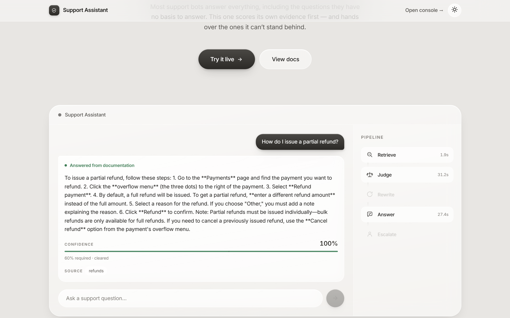
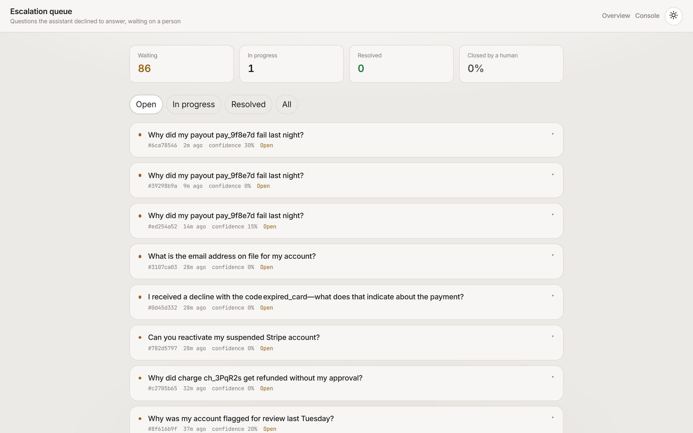

# Support Assistant

**A documentation-grounded support agent that scores its own evidence and escalates to a human instead of guessing.**

Most RAG chatbots answer every question they are asked, including the ones their
documentation cannot possibly answer. This one judges whether the retrieved
passages actually support an answer *before* writing one — and hands the
question to a person when they don't.



<sub>A real run: 100% confidence against a 60% threshold, one cited source, and
the pipeline showing which stages ran. Rewrite and Escalate are dimmed because
this question never needed them.</sub>

---

## The result

Measured against a plain RAG baseline on the same questions, same index, same models:

| | Plain RAG | Support Assistant |
|---|---|---|
| **In-scope answered** | 6/6 | **6/6** |
| **Out-of-scope hallucinated** | **2/5** | **0/5** |
| Out-of-scope escalated | 0 | **5/5** |
| Answer-rate lost to over-escalation | — | **0** |

The headline: **it eliminated hallucinated answers on out-of-scope questions
without answering fewer in-scope ones.** Abstention cost nothing in coverage.

What "hallucinated" looks like in practice — the baseline, asked about an
account it has no access to:

> **Q:** *Why was my account flagged for review last Tuesday?*
> **Plain RAG:** "Based on the documentation, your account was likely flagged
> because the **anomaly detection system** identified the transaction as
> anomalous…"
>
> **Support Assistant:** escalated to a human, confidence 0.30.

The baseline invented a cause and remediation steps for an account it had never
seen. That is the failure this project exists to prevent.

<sub>11 questions judged; the run stops early when the free-tier daily quota is
spent rather than reporting unjudged questions as results. Reproduce with
`python scripts/run_comparison.py`.</sub>

---

## How it decides

```
                    Question
                       │
                       ▼
              ┌─────────────────┐
              │    Retrieve     │  20 candidates → cross-encoder → top 5
              └────────┬────────┘
                       ▼
              ┌─────────────────┐
              │     Judge       │  LLM scores retrieval sufficiency (0.0–1.0)
              └────────┬────────┘
                       │
        ┌──────────────┼──────────────┐
        │              │              │
   score ≥ 0.6    score < 0.6    score < 0.6
        │         (first try)    (after retry)
        ▼              ▼              ▼
   ┌────────┐    ┌──────────┐   ┌──────────┐
   │ Answer │    │ Rewrite  │   │ Escalate │
   │ + cite │    │ + search ├──▶│ + ticket │
   └────────┘    └──────────┘   └──────────┘
                  (loops back
                   to Judge)
```

The judge is a **LangGraph conditional edge**: its verdict changes which node
runs next. That is what separates this from a pipeline — the LLM isn't just
producing text, it's making a routing decision.

**The retry is a real cycle.** A question that fails on vocabulary alone
(customers describe symptoms, docs describe mechanisms) gets restated in
documentation language and searched again before anyone gives up on it. Bounded
at one retry so nothing spins. It fired on 5 of 11 judged questions.

---

## What makes it different from a tutorial RAG

**Retrieval is two-stage.** Embedding search scores question and passage
separately, so it rewards topical overlap. A cross-encoder reads both together
and can tell that a page mentioning refunds throughout still never explains how
to issue a partial one. 20 candidates in, best 5 out.

**Every answer is auditable.** Confidence score against the threshold, the
judge's own stated reasoning, per-node timing, how many passages were weighed
and kept, and which model served the request — all returned with the answer.

**Escalations reach a person.** Tickets carry a triage summary written for the
agent who picks them up, and the queue moves them through open → in progress →
resolved. The handoff has another end.



**It survives its own dependencies.** 56 candidates across 5 API keys and 2
providers. A model that is down, throttled, or returns unparseable JSON is
skipped; a spent daily quota retires that whole account but leaves the others
running.

---

## Stack

| | |
|---|---|
| Orchestration | LangGraph (cyclic state graph) |
| LLMs | OpenRouter free models + Google Gemini, with failover |
| Embeddings | `all-MiniLM-L6-v2` (local, no API cost) |
| Reranking | `ms-marco-MiniLM-L-6-v2` cross-encoder (local) |
| Vector store | Chroma |
| Backend | FastAPI |
| Frontend | React + TypeScript + Tailwind (Vite) |

Everything except the LLM calls runs locally, and the LLM calls run on free tiers.

---

## Running it

```bash
# 1. Backend
cd backend
python -m venv .venv && .venv/Scripts/activate      # Windows
pip install -r requirements.txt
cp .env.example .env                                 # add your API keys

# 2. Build the index (scrapes 20 Stripe doc pages → 313 passages)
python -m app.ingestion.scrape_stripe_docs
python -m app.ingestion.build_index

# 3. Serve
uvicorn app.main:app --port 8000                     # ~40s model warmup

# 4. Frontend, in another terminal
cd frontend && npm install && npm run dev
```

Three surfaces: **`/`** overview and live demo · **`#/app`** operator console ·
**`#/queue`** escalation queue.

> **Keys:** `OPENROUTER_API_KEY` and `GEMINI_API_KEY` each accept several
> comma-separated keys. Free tiers are metered per account, so a second key is
> genuinely more daily budget.

---

## Evaluating it

```bash
cd backend
python scripts/generate_eval_set.py      # questions generated FROM indexed passages
python scripts/run_comparison.py         # agentic vs plain RAG, side by side
python scripts/run_eval.py               # escalation accuracy alone
python -m pytest -q                      # 33 tests
```

**The eval set is not hand-written.** Its answerable half is generated from
passages the index actually contains, so the passage is the ground truth rather
than the author's memory of what should work. The unanswerable half is drawn
from categories documentation structurally cannot cover: account-specific state,
legal advice, live figures, other companies' products.

Errors are reported **by direction**, because they don't cost the same:

- **Over-escalated** — answerable, but escalated. Wastes a person's time.
- **Wrongly answered** — should have escalated, answered anyway. A potentially
  wrong answer reaching a customer. This is the expensive one.

`CONFIDENCE_THRESHOLD` trades one against the other.

A run that cannot measure anything says so rather than reporting a number —
questions that never reached a judge are excluded, not scored.

---

## Latency

| | |
|---|---|
| Warm query | 2–11s |
| Cold start | ~40s (models load at startup, not on first request) |
| Overhead vs. plain RAG | ~2× — an extra judge call, plus a second retrieval when it retries |

That overhead is the price of not guessing. The models are ordered by measured
response time, since the head of the chain is what almost every request pays.

---

## Project layout

```
backend/
  app/
    graph/          retriever · confidence (judge) · answer · escalation · builder
    ingestion/      scrape → chunk → embed
    llm.py          multi-provider failover
    baseline.py     plain RAG, for comparison
  scripts/          eval set generation, comparison, escalation accuracy
  tests/            33 tests
frontend/
  src/landing/      overview + live demo
  src/components/   operator console
  src/queue/        escalation queue
```

---

## Honest limitations

- **Sample size.** 11 questions judged in the comparison run; free-tier quota
  stops it before the full 35. The direction is clear, the confidence interval
  is not tight.
- **One documentation set.** Built and measured against Stripe's docs. Nothing
  is Stripe-specific, but it hasn't been tried elsewhere.
- **The judge is a single model call.** A panel, or a calibrated classifier,
  would be steadier than one model's opinion.
- **Latency roughly doubles.** Acceptable for support, probably not for
  autocomplete.
