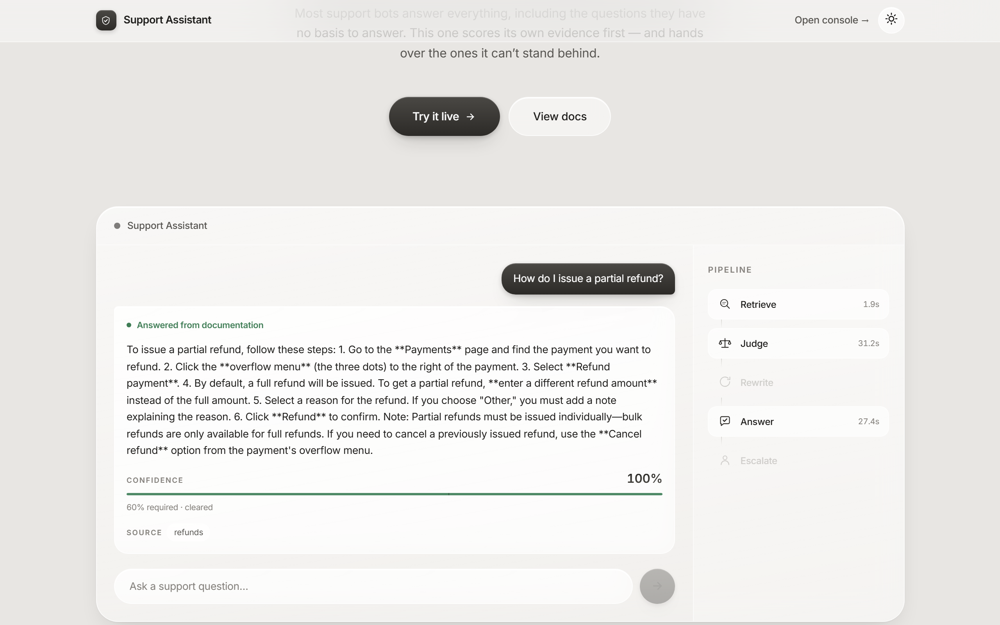
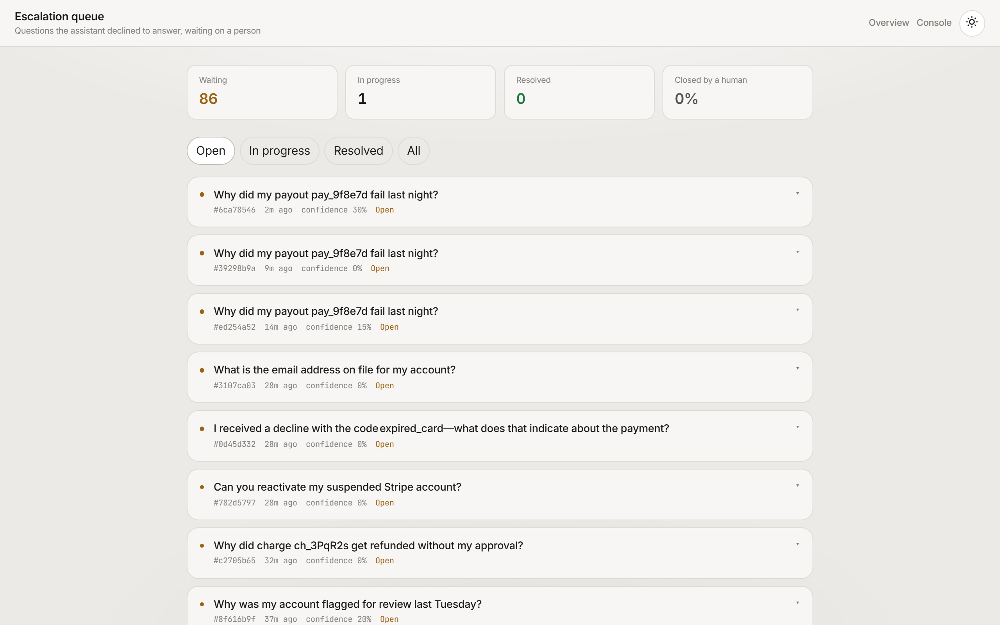

# Support Assistant

[](https://github.com/ahmedali-aihub/Agentic-RAG-Support-Assistant-with-Confidence-Based-Escalation/actions/workflows/ci.yml)
[](LICENSE)

**A documentation-grounded support agent that scores its own evidence and escalates to a human instead of guessing.**

Most RAG chatbots answer every question they are asked, including the ones their
documentation cannot possibly answer. This one judges whether the retrieved
passages actually support an answer *before* writing one — and hands the
question to a person when they don't.



<sub>A real run: 100% confidence against a 60% threshold, one cited source, and
the pipeline showing which stages ran. Rewrite and Escalate are dimmed because
this question never needed them.</sub>

---

## In plain English

### What it does

It's a support chatbot that's allowed to say "I don't know."

Most chatbots always answer, even when they're making it up. This one checks
its own work first — it searches the documentation, then asks a second step
to judge whether what it found actually answers the question, *before* writing
a single word. If the documentation covers it, it answers and shows its
source. If it doesn't, it doesn't guess — it hands the question to a person
instead.

### Why it's needed

Companies have been held to refund policies, discounts, and promises their
chatbot invented and a customer could reasonably believe. A bot that always
answers has no way to avoid that — it can't tell the difference between "I
know this" and "I'm guessing," because nothing in a normal RAG pipeline ever
asks. This project adds that question, and builds a real decision — answer or
escalate — around the result.

### How it helps

- **Trust** — every answer comes with a confidence score and a cited source,
  not a black box.
- **A real safety net** — when it hands off, the human doesn't start from
  nothing: there's a triage summary explaining what was asked, what was found,
  and why it wasn't enough.
- **It gets smarter over time** — when a human answers an escalated question,
  that answer is saved. Ask the same thing again, and the bot answers it
  directly — no second escalation.
- **It's worth a measurable amount of money** — the live demo includes a
  calculator: at 10,000 tickets a month and roughly half deflected, that's
  about **$990,000/year** in support costs a team never has to spend.

### What happens when the AI can't answer — the full path to a person

```
Customer asks a question
        │
        ▼
Search the documentation (RETRIEVE + RERANK — see below)
        │
        ▼
A second AI step JUDGES: "Do these results actually answer this?"
        │
        ├── Yes, confident ───────────────────► Answer, with a citation
        │
        └── No, not confident
                │
                ▼
        REWRITE the question in the documentation's own words,
        and search again (one retry, not a loop)
                │
                ├── Now confident ─────────────► Answer, with a citation
                │
                └── Still not confident
                        │
                        ▼
                ESCALATE:
                 1. An AI step writes a TRIAGE SUMMARY for the human agent
                    (what was asked, what was found, why it wasn't enough)
                 2. A TICKET is created and dropped into the agent queue
                 3. The customer gets a ticket number and a link to check
                    status at any time
                        │
                        ▼
                A HUMAN opens the ticket, reads the summary, writes
                the real answer
                        │
                        ▼
                The agent clicks "Resolve and teach" →
                the answer is EMBEDDED into the knowledge base
                        │
                        ▼
                The customer's ticket page now shows the answer, AND
                the next person who asks the same question gets it
                straight from the bot — no second escalation needed
```

That last loop — a human's answer teaching the bot so the same question never
escalates twice — is the part most support bots don't have.

### Where query rewriting and reranking fit in

These aren't side features; they're two of the four real steps in the pipeline
above, and they're the reason retrieval is harder than "search and return the
top result":

- **Reranking** happens on *every* search. The system pulls 20 possible
  matches first, then a second, more careful model (a cross-encoder) reads the
  question and each match *together* and picks the best 5. A fast search can
  find something topically related without actually answering the question —
  reranking is what catches that before it reaches the judge.
- **Query rewriting** happens only on a retry. Customers describe symptoms
  ("my card got rejected"); documentation describes mechanisms ("card
  declined, decline_code"). If the first search comes up short, an AI step
  rephrases the question in the documentation's own vocabulary and searches
  again — bridging exactly that gap — before the system gives up and escalates.

---

## The result

Measured against a plain RAG baseline on the same questions, same index, same models:

| | Plain RAG | Support Assistant |
|---|---|---|
| **In-scope answered** | 6/6 | **6/6** |
| **Out-of-scope hallucinated** | **2/5** | **0/5** |
| Out-of-scope escalated | 0 | **5/5** |
| Answer-rate lost to over-escalation | — | **0** |

The headline: **it eliminated hallucinated answers on out-of-scope questions
without answering fewer in-scope ones.** Abstention cost nothing in coverage.

What "hallucinated" looks like in practice — the baseline, asked about an
account it has no access to:

> **Q:** *Why was my account flagged for review last Tuesday?*
> **Plain RAG:** "Based on the documentation, your account was likely flagged
> because the **anomaly detection system** identified the transaction as
> anomalous…"
>
> **Support Assistant:** escalated to a human, confidence 0.30.

The baseline invented a cause and remediation steps for an account it had never
seen. That is the failure this project exists to prevent.

<sub>11 questions judged; the run stops early when the free-tier daily quota is
spent rather than reporting unjudged questions as results. Reproduce with
`python scripts/run_comparison.py`.</sub>

---

## How it decides

```
                    Question
                       │
                       ▼
              ┌─────────────────┐
              │    Retrieve     │  20 candidates → cross-encoder → top 5
              └────────┬────────┘
                       ▼
              ┌─────────────────┐
              │     Judge       │  LLM scores retrieval sufficiency (0.0–1.0)
              └────────┬────────┘
                       │
        ┌──────────────┼──────────────┐
        │              │              │
   score ≥ 0.6    score < 0.6    score < 0.6
        │         (first try)    (after retry)
        ▼              ▼              ▼
   ┌────────┐    ┌──────────┐   ┌──────────┐
   │ Answer │    │ Rewrite  │   │ Escalate │
   │ + cite │    │ + search ├──▶│ + ticket │
   └────────┘    └──────────┘   └──────────┘
                  (loops back
                   to Judge)
```

The judge is a **LangGraph conditional edge**: its verdict changes which node
runs next. That is what separates this from a pipeline — the LLM isn't just
producing text, it's making a routing decision.

**The retry is a real cycle.** A question that fails on vocabulary alone
(customers describe symptoms, docs describe mechanisms) gets restated in
documentation language and searched again before anyone gives up on it. Bounded
at one retry so nothing spins. It fired on 5 of 11 judged questions.

---

## What makes it different from a tutorial RAG

**Retrieval is two-stage.** Embedding search scores question and passage
separately, so it rewards topical overlap. A cross-encoder reads both together
and can tell that a page mentioning refunds throughout still never explains how
to issue a partial one. 20 candidates in, best 5 out.

**Every answer is auditable.** Confidence score against the threshold, the
judge's own stated reasoning, per-node timing, how many passages were weighed
and kept, and which model served the request — all returned with the answer.

**Escalations reach a person, and the answer reaches both ends.** Tickets carry
a triage summary written for the agent who picks them up, and the queue moves
them through open → in progress → resolved. The person who asked gets a ticket
number back and can look up its status at `#/ticket/<id>` at any time — that
lookup is a separate, narrower endpoint than the agent's queue view, so it
returns the question and the eventual answer but never the internal triage
summary or judge reasoning the agent sees. Resolving a ticket with an answer
also embeds it into the knowledge base, so the same question answers itself
directly the next time it's asked, instead of escalating again.



**It knows what it is.** A fixed, small set of questions about the assistant
itself ("tell me about yourself", "what can you do") are answered directly,
before retrieval runs — there's no documentation that could ever satisfy the
judge for a question that was never about the documentation, so routing those
through the judge only produced wrong escalations.

**It survives its own dependencies.** 56 candidates across 5 API keys and 2
providers. A model that is down, throttled, or returns unparseable JSON is
skipped; a spent daily quota retires that whole account but leaves the others
running.

---

## Stack

| | |
|---|---|
| Orchestration | LangGraph (cyclic state graph) |
| LLMs | OpenRouter free models + Google Gemini, with failover |
| Embeddings | `all-MiniLM-L6-v2` (local, no API cost) |
| Reranking | `ms-marco-MiniLM-L-6-v2` cross-encoder (local) |
| Vector store | Chroma |
| Backend | FastAPI |
| Frontend | React + TypeScript + Tailwind (Vite) |

Everything except the LLM calls runs locally, and the LLM calls run on free tiers.

---

## Running it

```bash
# 1. Backend
cd backend
python -m venv .venv && .venv/Scripts/activate      # Windows
pip install -r requirements.txt
cp .env.example .env                                 # add your API keys

# 2. Build the index (scrapes 20 Stripe doc pages → 313 passages)
python -m app.ingestion.scrape_stripe_docs
python -m app.ingestion.build_index

# 3. Serve
uvicorn app.main:app --port 8000                     # ~40s model warmup

# 4. Frontend, in another terminal
cd frontend && npm install && npm run dev
```

Four surfaces: **`/`** overview and live demo · **`#/app`** operator console ·
**`#/queue`** escalation queue (agent view) · **`#/ticket`** ticket lookup
(customer view — the id in that URL is the only access control there is, so it
returns the question and the eventual answer, never the agent's internal
triage notes).

> **Keys:** `OPENROUTER_API_KEY` and `GEMINI_API_KEY` each accept several
> comma-separated keys. Free tiers are metered per account, so a second key is
> genuinely more daily budget.

**Or with Docker** (the index is built into the image, so there's no separate
ingestion step):

```bash
cp backend/.env.example backend/.env    # add your API keys
docker compose up --build
```

Backend on `:8000`, frontend on `:5173`.

---

## Evaluating it

```bash
cd backend
python scripts/generate_eval_set.py      # questions generated FROM indexed passages
python scripts/run_comparison.py         # agentic vs plain RAG, side by side
python scripts/threshold_sweep.py        # what CONFIDENCE_THRESHOLD actually trades off
python scripts/run_eval.py               # escalation accuracy alone
python -m pytest -q                      # 81 tests, no API key required
```

**The eval set is not hand-written.** Its answerable half is generated from
passages the index actually contains, so the passage is the ground truth rather
than the author's memory of what should work. The unanswerable half is drawn
from categories documentation structurally cannot cover: account-specific state,
legal advice, live figures, other companies' products.

Errors are reported **by direction**, because they don't cost the same:

- **Over-escalated** — answerable, but escalated. Wastes a person's time.
- **Wrongly answered** — should have escalated, answered anyway. A potentially
  wrong answer reaching a customer. This is the expensive one.

`CONFIDENCE_THRESHOLD` trades one against the other.

A run that cannot measure anything says so rather than reporting a number —
questions that never reached a judge are excluded, not scored.

**The threshold has room either side of 0.6.** Re-scoring the judged questions
at every threshold from 0.3 to 0.9 shows the confidence scores are strongly
bimodal — the judge is either confident or it clearly isn't, with almost
nothing landing in between. The route only changes once, at 0.9, where a
single answerable question tips into escalation:

| Threshold | Answered | Escalated | Over-escalated | Wrongly answered |
|---|---|---|---|---|
| 0.3 – 0.8 | 6 | 5 | 0 | 0 |
| 0.9 | 5 | 6 | 1 | 0 |

That is a narrower sweep than the sample size can really claim, but the shape
of it — a threshold with slack on both sides rather than a knife-edge — is a
more comfortable place for a default to sit than the alternative.

---

## Latency

| | |
|---|---|
| Warm query | 2–11s |
| Cold start | ~40s (models load at startup, not on first request) |
| Overhead vs. plain RAG | ~2× — an extra judge call, plus a second retrieval when it retries |

That overhead is the price of not guessing. The models are ordered by measured
response time, since the head of the chain is what almost every request pays.

---

## Project layout

```
backend/
  app/
    graph/          retriever · confidence (judge) · meta · answer · escalation · builder
    ingestion/      scrape → chunk → embed
    llm.py          multi-provider failover
    baseline.py     plain RAG, for comparison
  scripts/          eval set generation, comparison, escalation accuracy
  tests/            81 tests, no API key required
frontend/
  src/landing/      overview + live demo
  src/components/   operator console
  src/queue/        escalation queue (agent view)
  src/ticket/       ticket status lookup (customer view)
```

---

## Honest limitations

- **Sample size.** 11 questions judged in the comparison run; free-tier quota
  stops it before the full 35. The direction is clear, the confidence interval
  is not tight.
- **One documentation set.** Built and measured against Stripe's docs. Nothing
  is Stripe-specific, but it hasn't been tried elsewhere.
- **The judge is a single model call.** A panel, or a calibrated classifier,
  would be steadier than one model's opinion.
- **Latency roughly doubles.** Acceptable for support, probably not for
  autocomplete.
- **Ticket lookup has no identity check beyond the id itself.** That id is an
  8-character random token, not a password, and there's no email or account
  match behind it — the same model a real support ticketing system without a
  login screen would use, but worth being explicit about.
